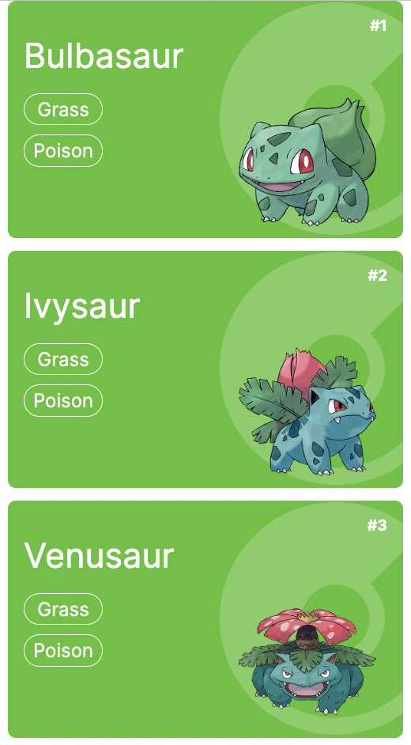

# Pokedex

A project that was inspired by my love of Pokemon and my desire to learn how to interact with APIs in ReactJS.

## Table of Contents

- [Overview](#overview)
  - [Goals](#goals)
  - [Screenshots](#screenshots)
  - [Links](#links)
  - [Built with](#built-with)

## Overview

### Goals

- [x] Learn how to interact with APIs
- [x] Practice building functional components and hooks
- [x] Generate Pokemon background color based on Pokemon's type
- [ ] Click on Pokemon card to open page with Pokemon's stats
- [ ] Search functionality (Name and National Pokedex Number)
- [ ] Display Pokemon in Pokedex format
- [ ] Pokedex button functionality 

### Screenshot

### Links

- Live Site URL: [GitHub Pages](https://xchristinawu.github.io/pokedex/)

### Built with

- HTML, CSS, JavaScript, React
